# System Architecture
## Energy-Efficient Sleep Scheduling and Power Optimization for IoT Sensor Nodes

---

## 1. Overview

The IoT Sleep Scheduling System is designed as a modular, extensible framework for simulating and optimizing energy consumption in wireless sensor networks. The architecture separates concerns into distinct layers while maintaining loose coupling between components.

### 1.1 Design Principles
- **Modularity**: Each component has a single responsibility
- **Extensibility**: New schedulers and sensors can be easily added
- **Testability**: All components can be unit tested independently
- **Performance**: Optimized for large-scale simulations
- **Maintainability**: Clear interfaces and well-documented code

### 1.2 Architecture Goals
- Support multiple scheduling algorithms
- Realistic energy modeling
- Scalable simulation engine
- Comprehensive data analysis
- Flexible configuration management

---

## 2. High-Level Architecture

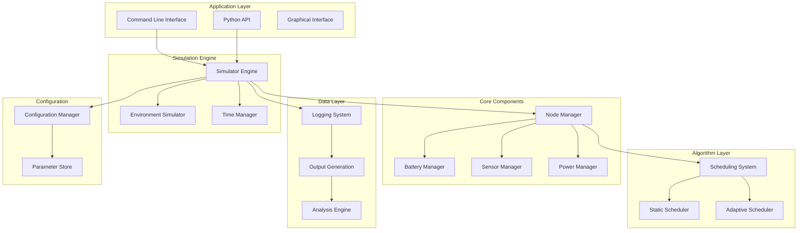

---

## 3. Component Architecture

### 3.1 Simulation Engine

The simulation engine orchestrates all components and manages the simulation timeline.

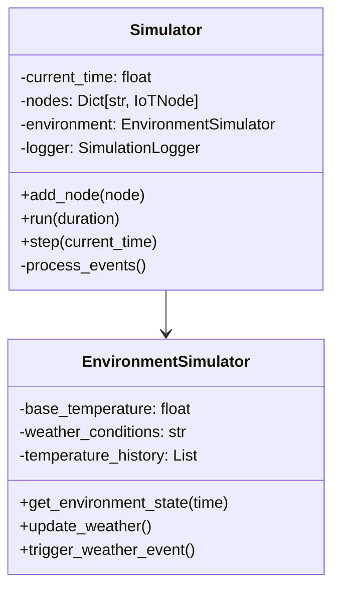

**Key Responsibilities:**
- Time management and event scheduling
- Node lifecycle management
- Environmental condition simulation
- Data collection and logging
- Performance monitoring

### 3.2 Node Management System

The node management system handles all IoT sensor node operations and state transitions.

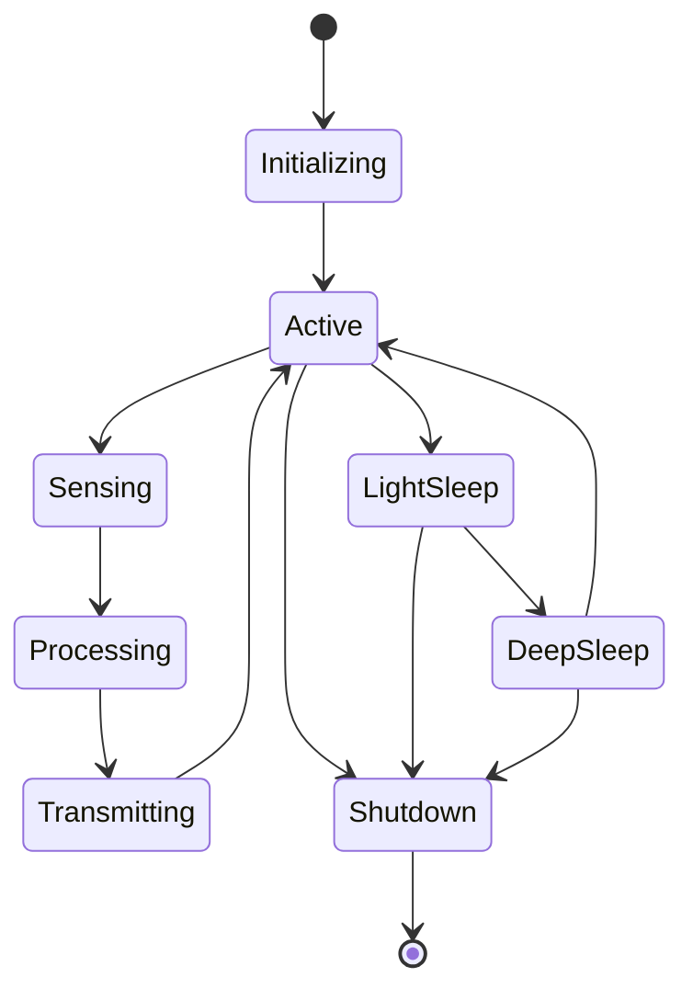

**Core Classes:**

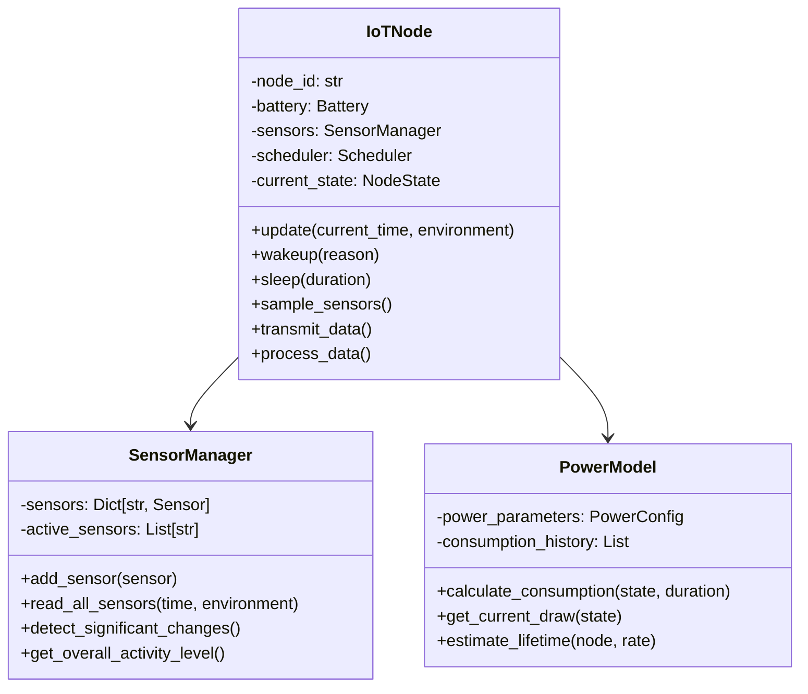

### 3.3 Scheduling System

The scheduling system implements different duty cycling algorithms with pluggable architecture.

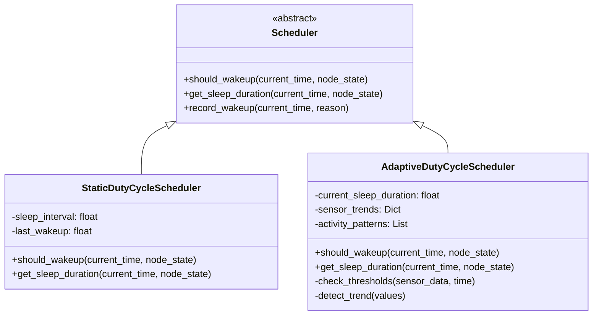

**Algorithm Flow:**

```mermaid
flowchart TD
    Start --> [Get Node State]
    [Get Node State] --> {Battery Critical?}
    {Battery Critical?} -->|Yes| [Enter Deep Sleep]
    {Battery Critical?} -->|No| {Thresholds Breached?}
    {Thresholds Breached?} -->|Yes| [Immediate Wakeup]
    {Thresholds Breached?} -->|No| {High Activity?}
    {High Activity?} -->|Yes| [Reduce Sleep Duration]
    {High Activity?} -->|No| {Battery Low?}
    {Battery Low?} -->|Yes| [Extend Sleep Duration]
    {Battery Low?} -->|No| [Normal Sleep]
    [Immediate Wakeup] --> [Process Data]
    [Reduce Sleep Duration] --> [Process Data]
    [Normal Sleep] --> [Enter Sleep Mode]
    [Extend Sleep Duration] --> [Enter Deep Sleep]
    [Enter Sleep Mode] --> [Wait for Timer]
    [Enter Deep Sleep] --> [Wait for Timer]
    [Wait for Timer] --> [Wake Up]
    [Wake Up] --> [Process Data]
    [Process Data] --> [Transmit Data]
    [Transmit Data] --> Start
    [Enter Deep Sleep] --> Start
```

### 3.4 Battery Management

The battery management system provides realistic energy modeling with multiple battery types and characteristics.

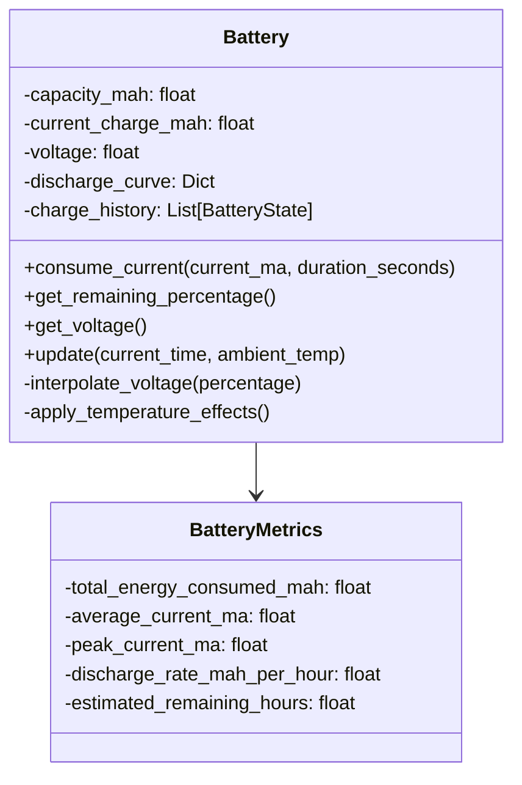

**Discharge Curve Model:**

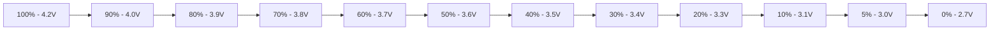

### 3.5 Sensor System

The sensor system provides realistic data generation with environmental correlation and failure simulation.

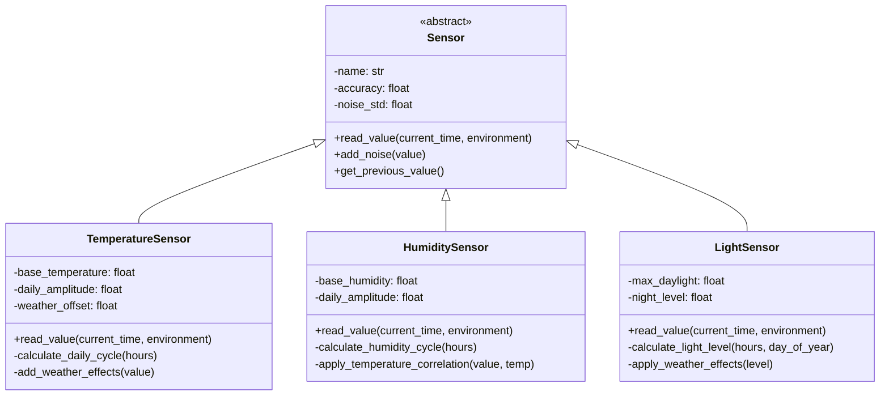

---

## 4. Data Flow Architecture

### 4.1 Simulation Data Flow

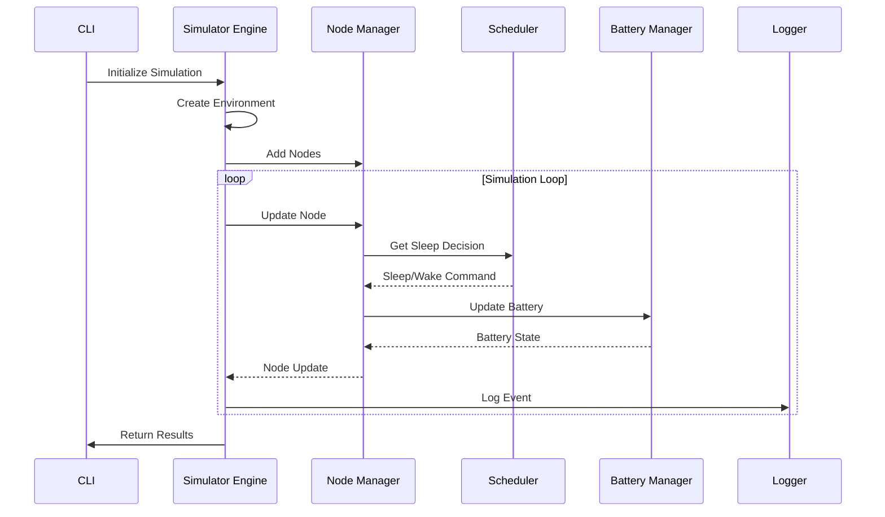

### 4.2 Scheduling Decision Flow

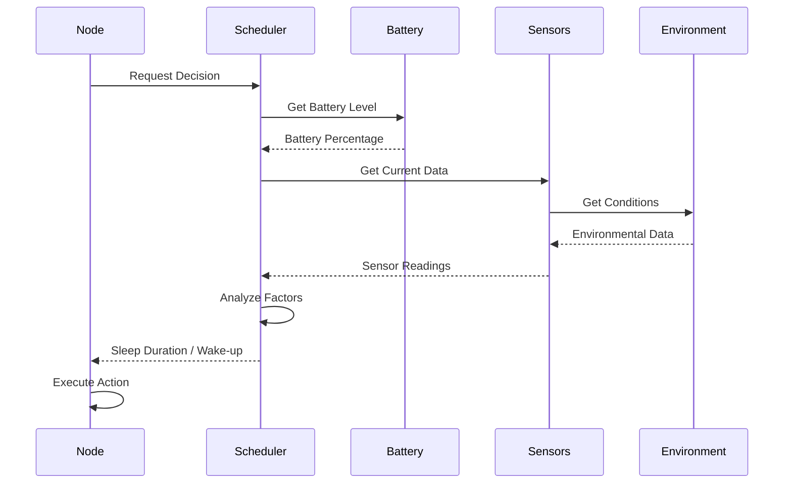

---

## 5. Configuration Architecture

### 5.1 Configuration Hierarchy

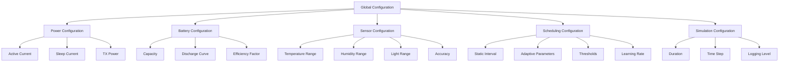

### 5.2 Parameter Management

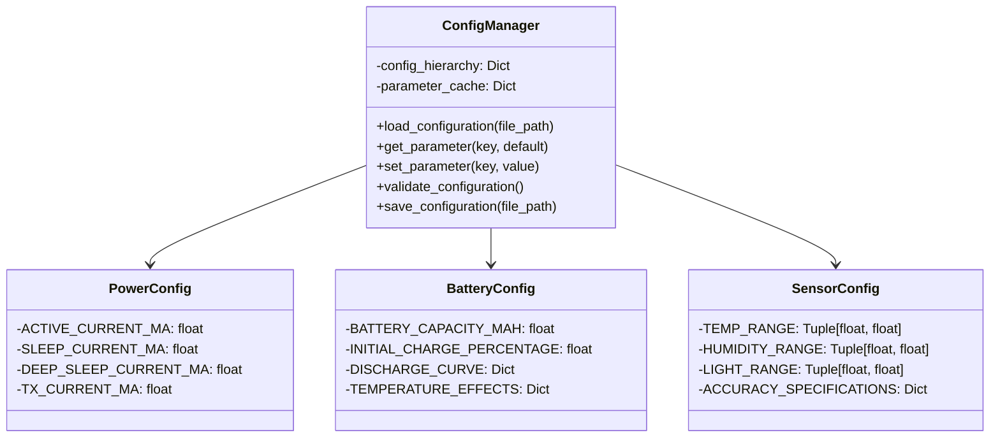

---

## 6. Plugin Architecture

### 6.1 Scheduler Plugin Interface

```python
class SchedulerPlugin:
    """Base interface for scheduler plugins"""

    def initialize(self, config: Dict) -> bool:
        """Initialize scheduler with configuration"""
        pass

    def should_wakeup(self, current_time: float, node_state: Dict) -> SchedulingDecision:
        """Determine if node should wake up"""
        pass

    def get_sleep_duration(self, current_time: float, node_state: Dict) -> float:
        """Calculate sleep duration"""
        pass

    def cleanup(self) -> None:
        """Clean up resources"""
        pass
```

### 6.2 Sensor Plugin Architecture

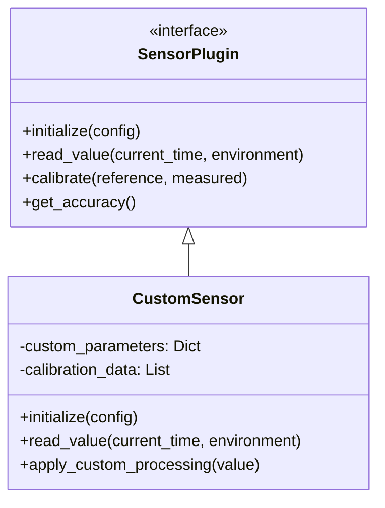

---

## 7. Performance Architecture

### 7.1 Optimization Strategies

**Memory Management:**
- Circular buffers for historical data
- Object pooling for frequently created objects
- Lazy loading of optional components
- Configurable data retention policies

**Execution Optimization:**
- Event-driven simulation architecture
- Parallelizable node updates
- Efficient time-stepping algorithm
- Cache frequently accessed calculations

**I/O Optimization:**
- Buffered logging with configurable flush intervals
- Batch processing of sensor readings
- Asynchronous data export
- Compressed historical data storage

### 7.2 Scalability Architecture

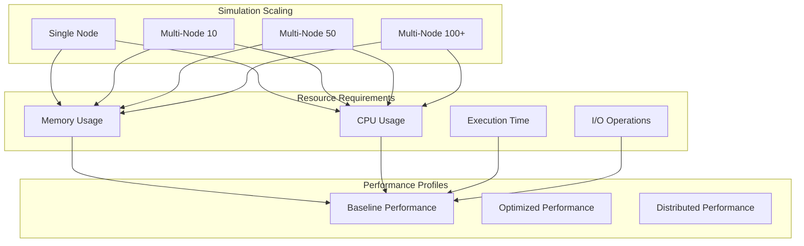

---

## 8. Security Architecture

### 8.1 Data Protection

- **Input Validation**: All configuration parameters validated
- **Type Safety**: Strong typing for all interfaces
- **Memory Safety**: Automatic memory management in Python
- **File I/O Safety**: Secure file handling with error checking

### 8.2 Simulation Integrity

- **Deterministic Results**: Consistent output for same inputs
- **Reproducible Research**: Fixed seed values for random processes
- **Audit Trail**: Complete logging of all operations
- **Version Control**: Configuration and model versioning

---

## 9. Interface Specifications

### 9.1 Public API

```python
class SimulationAPI:
    """Public interface for simulation system"""

    def __init__(self, config_path: str = None):
        """Initialize simulation with optional configuration"""
        pass

    def create_simulation(self, duration_hours: float, **kwargs) -> str:
        """Create new simulation with specified parameters"""
        pass

    def add_node(self, node_type: str, scheduler_type: str, **params) -> None:
        """Add node to simulation"""
        pass

    def run_simulation(self) -> Dict[str, Any]:
        """Run complete simulation"""
        pass

    def get_results(self) -> Dict[str, Any]:
        """Get simulation results"""
        pass

    def export_results(self, format: str, output_path: str) -> bool:
        """Export results to specified format"""
        pass
```

### 9.2 CLI Interface

```bash
# Basic simulation
python -m iot_sleep_scheduler run --mode basic --duration 24

# Comparative analysis
python -m iot_sleep_scheduler run --mode comparative

# Custom configuration
python -m iot_sleep_scheduler run --config custom_config.json

# Scalability testing
python -m iot_sleep_scheduler run --mode scalability --nodes 50
```

---

## 10. Deployment Architecture

### 10.1 Development Environment

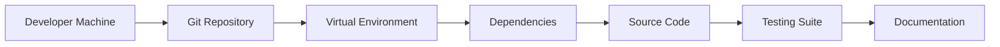

### 10.2 Production Deployment

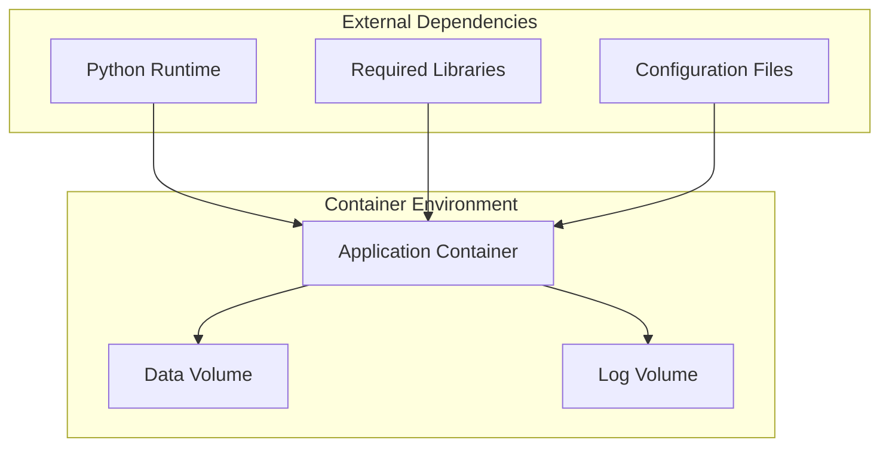

---

## 11. Evolution Architecture

### 11.1 Extension Points

- **New Schedulers**: Plugin-based scheduler architecture
- **Custom Sensors**: Modular sensor framework
- **Advanced Analysis**: Extensible analysis engine
- **Visualization**: Pluggable graph generation system

### 11.2 Future Enhancements

- **Machine Learning**: Integration of ML-based optimization
- **Distributed Simulation**: Multi-node simulation across clusters
- **Real-World Integration**: Hardware-in-the-loop testing
- **Web Interface**: Browser-based configuration and visualization

---

**Document Version**: 1.0
**Last Updated**: 2025-11-25
**Next Review**: 2025-12-25