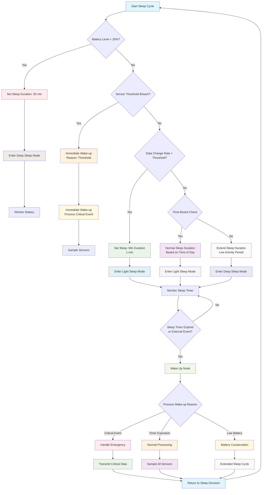
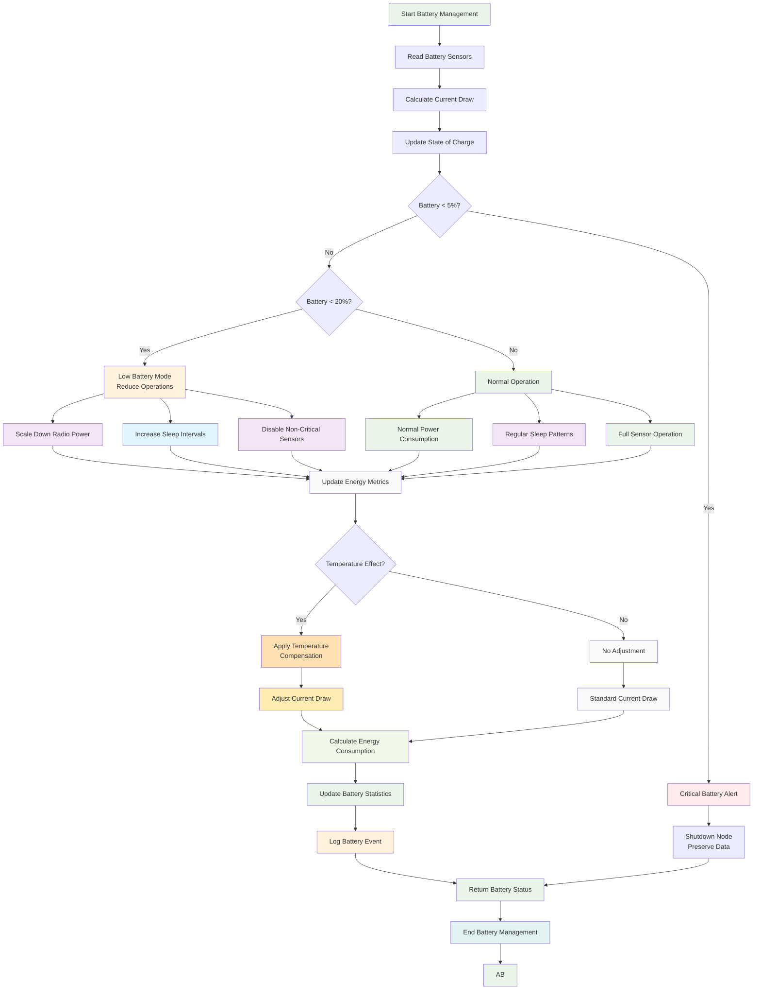
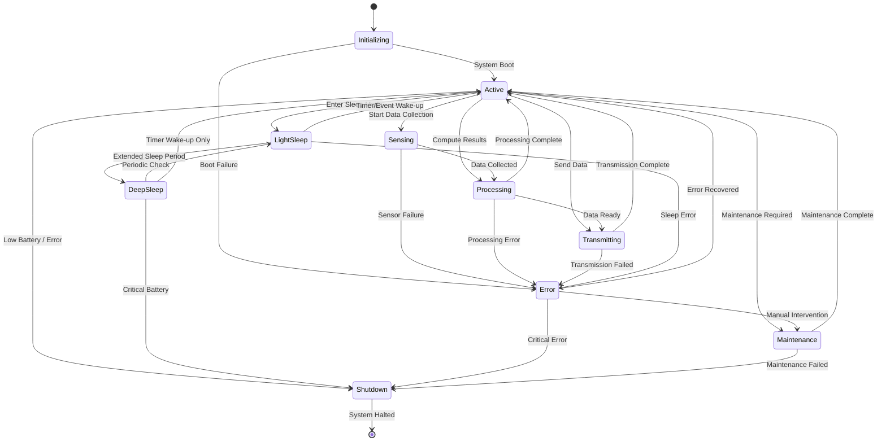
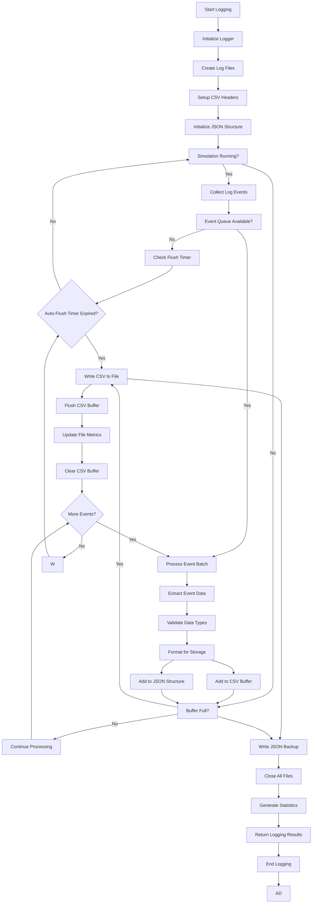
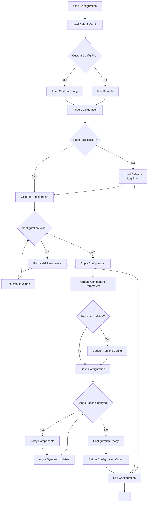
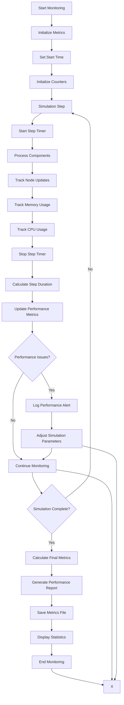

# Algorithm Flowcharts
## Energy-Efficient Sleep Scheduling and Power Optimization for IoT Sensor Nodes

---

## 1. Adaptive Duty Cycling Algorithm

The adaptive duty cycling algorithm is the core optimization mechanism that dynamically adjusts sleep patterns based on multiple factors.



---

## 2. Battery Management Algorithm

The battery management algorithm monitors energy consumption and optimizes node operation for maximum lifetime.



---

## 3. Sensor Data Processing Pipeline

The sensor data processing pipeline handles multiple sensor types with realistic environmental correlation and noise modeling.

```mermaid
flowchart TD
    A[Start Sensor Processing] --> B[Get Current Time]
    B --> C{Check Sampling Interval}
    C -->|Not Due| D[Wait for Next Interval]
    C -->|Due| E[Read All Sensors]

    E --> F[Temperature Sensor]
    E --> G[Humidity Sensor]
    E --> H[Light Sensor]

    F --> I[Generate Temperature Value]
    I --> J[Add Environmental Noise]
    J --> K[Apply Calibration]
    K --> L[Validate Range]

    G --> M[Generate Humidity Value]
    M --> N[Apply Temperature Correlation]
    N --> O[Add Weather Effects]
    O --> P[Apply Calibration]
    P --> Q[Validate Range]

    H --> R[Generate Light Value]
    R --> S[Calculate Sun Position]
    S --> T[Apply Day/Night Cycle]
    T --> U[Add Weather Conditions]
    U --> V[Apply Calibration]
    V --> W[Validate Range]

    L --> X[Store Temperature Reading]
    Q --> Y[Store Humidity Reading]
    W --> Z[Store Light Reading]

    X --> AA{Sensor Failure?}
    Y --> AA
    Z --> AA
    AA -->|Yes| AB[Mark Reading Invalid]
    AA -->|No| AC[Reading Valid]

    AB --> AD[Log Error Event]
    AC --> AD
    AD --> AE[Check for Significant Changes]

    AE --> AF{Change Detected?}
    AF -->|Yes| AG[Trigger High Activity]
    AF -->|No| AH[Normal Operation]

    AG --> AI[Update Activity Metrics]
    AH --> AI
    AI --> AJ[Return Sensor Data]

    D --> AK[Wait for Sensor Interval]
    AJ --> AL[Update Node State]
    AK --> B
    AL --> AM[End Sensor Processing]
    AM --> AN

    style A fill:#e3f2fd
    style E fill:#e8f5e8
    style F fill:#fff3e0
    style G fill:#e0f2f1
    style H fill:#f3e5f5
    style I fill:#fff9c4
    style J fill:#ffecb3
    style K fill:#fffde7
    style L fill:#fff8e1
    style M fill:#fff9c4
    style N --> O
    style O --> P
    style P --> Q
    style Q --> R
    style R --> S
    style S --> T
    style T --> U
    U --> V
    style V --> W
    style W --> X
    style X --> Y
    style X --> Z
    style AB fill:#ffebee
    style AC fill:#f1f8e9
    style AE fill:#fafafa
    style AF --> AG
    style AF --> AH
    style AG --> AI
    style AH --> AI
    style AI --> AJ
    style AK fill:#f5f5f5
    style AL fill:#e0f2f1
    style AN fill:#e3f2fd
```

---

## 4. Power Consumption Calculation

The power consumption algorithm accurately tracks energy usage across different operational states.

```mermaid
flowchart TD
    A[Start Power Calculation] --> B[Get Current Node State]
    B --> C{Node State Type}

    C -->|Active| D[Active Mode Power]
    C -->|Light Sleep| E[Light Sleep Power]
    C -->|Deep Sleep| F[Deep Sleep Power]
    C -->|Transmitting| G[Transmission Power]
    C -->|Sensing| H[Sensing Power]
    C -->|Processing| I[Processing Power]

    D --> J[CPU + Sensors + Radio<br/>Base Current]
    E --> K[CPU + Watchdog<br/>Low Power]
    F --> L[Real-Time Clock Only<br/>Ultra Low Power]
    G --> M[Radio Burst<br/>High Power]
    H --> N[ADC + Sensors<br/>Medium Power]
    I --> O[Data Processing<br/>Variable Power]

    J --> P[Get Temperature]
    K --> P
    L --> P
    M --> P
    N --> P
    O --> P
    I --> P

    P --> Q{Temperature Compensation Required?}
    Q -->|Yes| R[Apply Temperature Factor]
    Q -->|No| S[Standard Current]

    R --> T[Adjust Current: I × (1 + β × ΔT)]
    S --> U[Use Base Current]

    T --> V[Calculate Power: P = V × I]
    U --> V
    V --> W[Calculate Duration]

    W --> X{Duration in Seconds?}
    X -->|Yes| Y[Energy = Power × Duration / 3600]
    X -->|No| Z[Duration in Hours]

    Y --> AA[Convert to mAh<br/>Energy (mAh) = Current (mA) × Time (h)]
    Z --> AB[Convert to mAh<br/>Energy (mAh) = Current (mA) × Time (h)]

    AA --> AC[Apply Efficiency Factor]
    AB --> AD[Final Energy Consumption]
    Z --> AC
    AD --> AE[Update Power Metrics]
    AE --> AF[Log Energy Event]
    AF --> AG[Return Energy Data]
    AC --> AH
    AH --> AI[End Power Calculation]
    AI --> AJ

    style A fill:#f3e5f5
    style D fill:#ff9800
    style E fill:#4caf50
    style F fill:#2196f3
    style G fill:#f44336
    style H fill:#9c27b0
    style I fill:#795548
    style J fill:#fafafa
    style K fill:#fafafa
    style L fill:#fafafa
    style M fill:#fafafa
    style N fill:#fafafa
    style O fill:#fafafa
    style P fill:#f5f5f5
    style Q fill:#fafafa
    style R fill:#fff9c4
    style S fill:#fafafa
    style T fill:#fffde7
    style U fill:#fafafa
    style V fill:#f1f8e9
    style W fill:#e3f2fd
    style X fill:#fafafa
    style Y fill:#e8f5e8
    style Z fill:#e8f5e8
    style AA fill:#e8f5e8
    style AB fill:#e0f2f1
    style AC fill:#e8f5e8
    style AD fill:#e0f2f1
    style AE fill:#e0f2f1
    style AF fill:#e0f2f1
    style AG fill:#e0f2f1
    style AH fill:#e0f2f1
    style AI fill:#e0f2f1
```

---

## 5. Simulation Engine Main Loop

The simulation engine main loop orchestrates all components and manages the simulation timeline.

```mermaid
flowchart TD
    A[Start Simulation] --> B[Initialize Components]
    B --> C[Load Configuration]
    C --> D[Create Environment]
    D --> E[Add IoT Nodes]
    E --> F[Setup Logging]

    F --> G[current_time = 0]
    G --> H{current_time < end_time?}

    H -->|Yes| I[Update Environment]
    I --> J[Update All Nodes]

    J --> K[For Each Node]
    K --> L[Get Node State]
    L --> M[Check Scheduling Decision]
    M --> N{Should Wake Up?}

    N -->|Yes| O[Wake Up Node]
    N -->|No| P[Continue Sleeping]

    O --> Q[Process Wake-up Reason]
    Q --> R[Sample Sensors]
    R --> S[Process Data]
    S --> T[Transmit if Needed]
    T --> U[Update Node Metrics]

    P --> V[Update Sleep Metrics]
    V --> W[Consume Sleep Energy]

    U --> W
    W --> X{More Nodes?}
    V --> X
    X -->|Yes| K
    X -->|No| Y[Log Simulation Step]

    Y --> Z[Update Simulation Time]
    Z --> AA[Check Progress Callbacks]
    AA --> AB[current_time++]
    AB --> H

    H -->|No| AC[Generate Results]
    AC --> AD[Create Analysis Reports]
    AD --> AE[Generate Graphs]
    AE --> AF[Save Metrics]
    AF --> AG[Close Logging]
    AG --> AH[End Simulation]
    AH --> AI

    style A fill:#e3f2fd
    style B fill:#f5f5f5
    style C fill:#fafafa
    style D fill:#e8f5e8
    style E fill:#f3e5f5
    style F fill:#fff3e0
    style G fill:#e1f5fe
    style H fill:#fafafa
    style I fill:#e0f2f1
    style J --> K
    style K --> L
    style L --> M
    style M --> N
    style N --> O
    style N --> P
    style O --> Q
    style Q --> R
    style R --> S
    style S --> T
    style T --> U
    style U --> W
    style P --> W
    style W --> X
    style X --> Y
    style Y --> Z
    style Z --> AA
    AA --> AB
    style AB --> H
    style AC fill:#f5f5f5
    style AD fill:#f3e5f5
    style AE fill:#fff3e0
    style AF fill:#e8f5e8
    style AG fill:#e0f2f1
    style AH fill:#e0f2f1
    style AI fill:#e0f2f1
```

---

## 6. Node State Machine

The node state machine manages the different operational states and transitions for each IoT node.



---

## 7. Data Logging Workflow

The data logging workflow manages the collection and storage of simulation data in multiple formats.



---

## 8. Configuration Management

The configuration management system handles parameter loading, validation, and persistence.



---

## 9. Performance Monitoring

The performance monitoring system tracks simulation efficiency and resource usage.



---

## 10. Error Handling and Recovery

The error handling system provides robust recovery mechanisms for various failure scenarios.

```mermaid
flowchart TD
    A[Start Error Handler] --> B{Error Detected?}
    B -->|No| C[Normal Operation]
    B -->|Yes| D[Categorize Error]

    D --> E{Critical Error?}
    E -->|Yes| F[Initiate Emergency Shutdown]
    E -->|No| G{Recoverable Error?}

    F --> H[Save Current State]
    H --> I[Close All Connections]
    I --> J[Log Critical Error]
    J --> K[Exit with Error Code]

    G -->|Yes| L[Attempt Recovery]
    G -->|No| M[Log Error and Continue]

    L --> N{Recovery Successful?}
    N -->|Yes| O[Log Recovery]
    N -->|No| P[Escalate to Critical]

    O --> Q[Resume Operation]
    P --> F
    M --> R[Continue with Fallback]

    Q --> S{Error Resolved?}
    R -->|Yes| C
    R -->|No| M]

    C --> T[Continue Normal Operation]
    K --> U[Return Error Status]
    Q --> T
    X --> V[End Error Handler]
```

---

**Document Version**: 1.0
**Last Updated**: 2025-11-25
**Next Review**: 2025-12-25